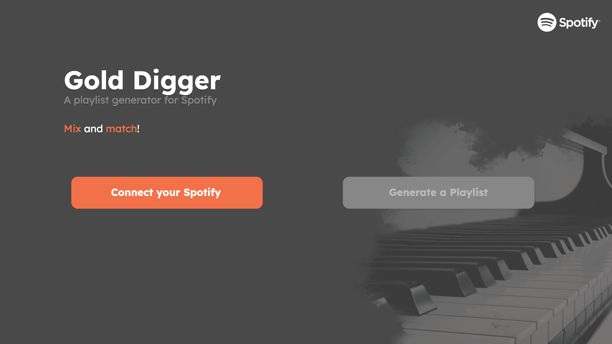

<!-- Title and Logo -->
 

  

  <h3 align="center">Gold Digger - A iprogd Project</h3>

  

    Generate a Spotify playlist out of your
     
     
    <a href="https://gold-digger-be2ef.web.app/">Deployed Site</a>
    ·
    <a href="https://www.figma.com/file/3TpeoyPVti5l0aqRASbQL3/Gold-Digger-mock-up?node-id=0%3A1&t=UOCqxbzFzoUMvWx5-1">View Demo</a>
  

<!-- Table of Contents -->

  
Table of Contents

  <ol>
    <li>
      <a href="#description">Description</a>
      <ul>
        <li><a href="#built-with">Built With</a></li>
      </ul>
    </li>
    <li><a href="#progress">Progress</a></li>
    <li><a href="#roadmap">Roadmap</a></li>
    <li>
      <a href="#project-file-structure">Project File Structure</a>
      <ul>
        <li><a href="#built-with">Built With</a></li>
      </ul>
    </li>
  </ol>

## **Description**

How to use:
Dummy account

### Built with
* [![Spotify][spotify-shield]][spotify-url]
* 

## **Progress - What we have done**

## **Roadmap - What we plan to do**

## **Project File Structure**
Short description and purpose of each file, a bit of an introduction here

### File 1

<!-- Links & Images -->
[spotify-shield]:https://camo.githubusercontent.com/f63f025c4f4797f4e0cf1904d1c87d02179a369b11948d5023af396d30dcad7b/68747470733a2f2f696d672e736869656c64732e696f2f7374617469632f76313f7374796c653d666f722d7468652d6261646765266d6573736167653d53706f7469667926636f6c6f723d314442393534266c6f676f3d53706f74696679266c6f676f436f6c6f723d464646464646266c6162656c3d
[spotify-url]:https://developer.spotify.com/documentation/web-api