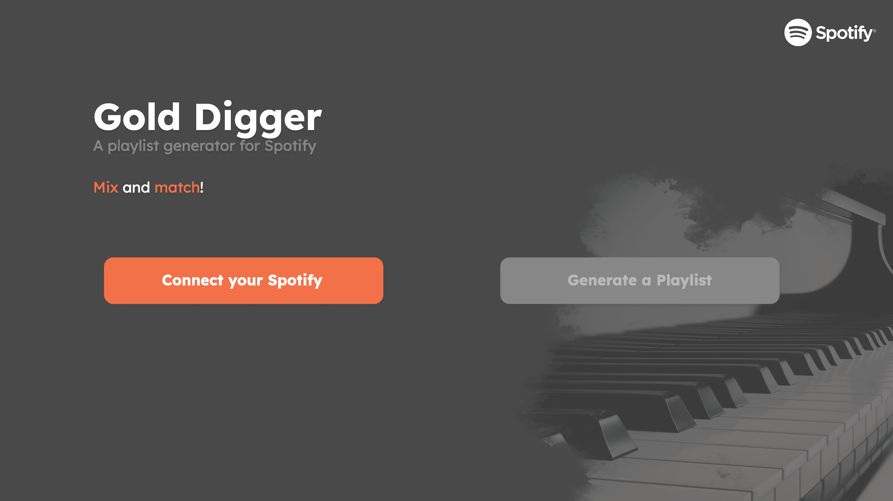

<a name="readme-top"></a>

<!-- Title and Logo -->
<br />
<div align="center">
  <a href="https://github.com/dynamisk-webb/Gold-Digger">
      
  </a>

  <h3 align="center">Gold Digger</h3>

  <p align="center">
    An iprogd Project website that generates a Spotify playlist based on selected parameters and your own library.
    <br />
    <br />
    <a href="https://gold-digger-be2ef.web.app/" target="_blank">Deployed Site</a>
    ·
    <a href="https://www.figma.com/file/3TpeoyPVti5l0aqRASbQL3/Gold-Digger-mock-up?node-id=0%3A1&t=UOCqxbzFzoUMvWx5-1" target="_blank">View Interactive Prototype</a>
  </p>
</div>

<!-- Table of Contents -->
<details>
  <summary>Table of Contents</summary>
  <ol>
    <li>
      <a href="#about-the-Project">About the Project</a>
      <ul>
        <li><a href="#built-with">Built With</a></li>
      </ul>
    </li>
    <li><a href="#demo">Demo</a></li>
    <li>
      <a href="#getting-started">Getting Started</a>
      <ul>
        <li><a href="#prerequisites">Prerequisites</a></li>
        <li><a href="#installation">Installation</a></li>
      </ul>
    </li>
    <li>
      <a href="#project">Project</a>
      <ul>
        <li><a href="#application">Application</a></li>
        <li><a href="#user-testing">User Testing</a></li>
      </ul>
    </li>
    <li><a href="#project-file-structure">Project File Structure</a></li>
    <li><a href="#contact">Contact</a></li>
  </ol>
</details>

## **About the Project**
<div align="center" style="margin: 10px;">
  
</div>

Have you ever thought: "Yikes! I got too many songs in my Spotify Playlist but I just feel like listening [Insert Artist] today...", well that's something every single one of us in our project group had experienced. And what better opportunity to fix this problem than implementing it ourselves during the ``iprogd`` course. Voila, Gold Digger 🎉!

Gold Digger helps Spotify users generate new playlists from parts of their pre-existing playlists, or liked songs. You can select what genres, artists you'd like to listen to today and/or if you want a real danceable song according to your current *mood*.

The app is compatible with any public or private playlist accessible to your account. Gold Digger requires access to your Spotify account to connect to **Spotify's API** and **Spotify Premium** to play tracks on the audio player.

&nbsp;

### Built with
* [![Javascript][js-shield]][js-url]
* [![Node.js][node-shield]][node-url]
* [![React][react-shield]][react-url]
* [![React Router][router-shield]][router-url]
* [![MUI][mui-shield]][mui-url]
* [![npmjs][npm-shield]][npm-url]
* [![Spotify][spotify-shield]][spotify-url]

We're using the following third-party components https://github.com/gilbarbara/react-spotify-web-playback that uses Spotify Web Playback SDK and react-infinite-scroller https://www.npmjs.com/package/react-infinite-scroller

## **Demo**

1. Go to the deployed <a href="https://gold-digger-be2ef.web.app/">site</a>
2. You need a Spotify to connect to and Spotify API needs to register the username before using as the application is in Development Mode. **Log in with this dummy account to test the app:**
```
  Email: test.iprogd@gmail.com
  Password: testare_iprogd
```

This is because Spotify doesn't grant a quota extension for home/school project.

## **Getting Started**

### Prerequisites

This uses npm, Spotify Developer project and Firebase project to install

* npm: https://docs.npmjs.com/downloading-and-installing-node-js-and-npm.
* Spotify Developer: https://developer.spotify.com/dashboard
* Firebase: https://console.firebase.google.com/

The application is made to view on a desktop browser.

### Installation

1. Clone the repo
```
git clone https://github.com/dynamisk-webb/Gold-Digger.git
```

2. Copy your Client ID at https://developer.spotify.com/dashboard from your Spotify Project
  
3. Add apiConfig.js in ``/gold-digger/src`` with following:
```javascript
export {CLIENT_ID, REDIRECT_URI}

const CLIENT_ID = 'YOUR CLIENT ID';

const REDIRECT_URI = 'http://localhost:3000/redirect';
```

4. Get your Firebase Configuration from https://console.firebase.google.com/

5. Add firebaseConfig.js with the configuration and set it as ``export default``

6. Install NPM packages with the ``package.json`` file available in ``/gold-digger``:
```
npm install
```

1. Compile and start the app
```
npm start
```

<p align="right">(<a href="#readme-top">back to top</a>)</p>

## **Project**
### Application

The main idea with the project is to create a playlist from your saved tracks/an input playlist by retrieving select information from the Spotify API. Tracks are filtered from specific parameters of the track and the possibility to not select for specific parameters is also allowed (e.g. if you don't care about which artists are included).

The select parameters are:
 - Genre
 - Artists (Include/Exclude)
 - Tempo (BPM)
 - Loudness (Noise)
 - Danceability
 - Instrumentality
 - Acousticness

The layout was initially made in Figma and the specifications were set based on the available Spotify APIs endpoints.

Max size is set to: ``30``. To change this go into ``/gold-digger/src/presenters/loadingPresenter.js`` and change this line of code:
```javascript
    const playlistMaxLength = 30; // Change to increase playlist size
```

Both Genre and Artist views have a functional search bar, and share a view to not repeat code, which saves the displayed artists in component state. 

The Parameter view combines the parameters: tempo, loudness, danceability, instrumentatlity and acousticness into one. It uses sliders and buttons from MUI to display.

After going through the parameters, a loading screen is displayed. It has an audioplayer if the user would like to listen to a bit of standby music for suspense whilst the system updates you of the status of the list. There is also suspsense for genres, artists and such

The final playlist view displays the generated playlist and gives you the option to save the playlist to Spotify, delete songs and/or delete the whole playlist.

All of the model data is persisted with Firebase every time a change is made.

The project was divided into following concerns:
- API calls (Spotify API)
- Audio player (Third party component)
- Authentication (OAuth 2.0)
- Persistence (Firebase)
- Presenter (React/Javascript) 
- View (React/Javascript/MUI)

*See <a href="https://github.com/dynamisk-webb/Gold-Digger/issues">issues</a> for more detailed documentation of bugs and features.*

&nbsp;   

### User Testing

We have a clickable <a href="https://www.figma.com/file/3TpeoyPVti5l0aqRASbQL3/Gold-Digger-mock-up?node-id=0%3A1&t=UOCqxbzFzoUMvWx5-1">digital prototype</a> made in Figma that we have used for the first user testing which represents our vision.

A second user testing was performed further down the project timeline once we had a running application. This prompted many graphical changes, such as adding tool tips to all fields and changing alot of icons, and an example of a feature added from tests include: Option to save (or not save) playlist to your Spotify account.

<p align="right">(<a href="#readme-top">back to top</a>)</p>

## **Project File Structure**

We're following the MVP-architecture for the project.

Project files for the app are under `/gold-digger/`. The project code follows the following file structure:
```
│   App.js
│   authentication.js
│   DiggerModel.js
│   firebaseModel.js
│   index.js
│   reportWebVitals.js
│   resolvePromise.js
│   Root.js
│   spotifySource.js
├───presenters
│       artistPresenter.js
│       genrePresenter.js
│       homePresenter.js
│       layoutPresenter.js
│       loadingPresenter.js
│       loginPresenter.js
│       parameterPresenter.js
│       playlistPresenter.js
│       redirectPresenter.js
│       sourcePresenter.js
│
├───static
│       App.css
│       index.css
│
└───views
        aboutUsView.js
        artistResultView.js
        audioPlayView.js
        filterView.js
        genreResultView.js
        homeView.js
        layoutView.js
        loadingView.js
        loginView.js
        parameterView.js
        playlistView.js
        prevListView.js
        promiseNoData.js
        searchView.js
        sourceView.js
        waitForFirebase.js
```

<p align="right">(<a href="#readme-top">back to top</a>)</p>

## **Contact**
**Made for ``iprogd`` at KTH**

Jessica Gorwat – jgorwat@kth.se

Julia Wang – julwan@kth.se

Maria Moliteus – moliteus@kth.se

Rej Karlander – isakkar@kth.se

<p align="right">(<a href="#readme-top">back to top</a>)</p>

<!-- Links & Images -->
[spotify-shield]:https://camo.githubusercontent.com/f63f025c4f4797f4e0cf1904d1c87d02179a369b11948d5023af396d30dcad7b/68747470733a2f2f696d672e736869656c64732e696f2f7374617469632f76313f7374796c653d666f722d7468652d6261646765266d6573736167653d53706f7469667926636f6c6f723d314442393534266c6f676f3d53706f74696679266c6f676f436f6c6f723d464646464646266c6162656c3d
[spotify-url]:https://developer.spotify.com/documentation/web-api
[react-shield]:https://camo.githubusercontent.com/67a01fa7cf337616274f39c070a11638f2e65720e414ef55b8dd3f9c2a803b2a/68747470733a2f2f696d672e736869656c64732e696f2f7374617469632f76313f7374796c653d666f722d7468652d6261646765266d6573736167653d526561637426636f6c6f723d323232323232266c6f676f3d5265616374266c6f676f436f6c6f723d363144414642266c6162656c3d
[react-url]:https://react.dev/
[node-shield]:https://camo.githubusercontent.com/faec9d89bd2c7d47b91d988dcd0f27011c27e8191d45836cfa36bf2b3c2a92bd/68747470733a2f2f696d672e736869656c64732e696f2f7374617469632f76313f7374796c653d666f722d7468652d6261646765266d6573736167653d4e6f64652e6a7326636f6c6f723d333339393333266c6f676f3d4e6f64652e6a73266c6f676f436f6c6f723d464646464646266c6162656c3d
[node-url]:https://nodejs.org/en
[mui-shield]:https://camo.githubusercontent.com/208852c2348eb4c34115c18e7bc1364ef7ccc88a76a8e659a7ba13c4da7318c0/68747470733a2f2f696d672e736869656c64732e696f2f7374617469632f76313f7374796c653d666f722d7468652d6261646765266d6573736167653d4d554926636f6c6f723d303037464646266c6f676f3d4d5549266c6f676f436f6c6f723d464646464646266c6162656c3d
[mui-url]:https://mui.com/
[npm-shield]: https://camo.githubusercontent.com/fd60ad1cae960eb3117e20dc1305b39f820004bf601b0e00ea032eccb9897dfd/68747470733a2f2f696d672e736869656c64732e696f2f7374617469632f76313f7374796c653d666f722d7468652d6261646765266d6573736167653d6e706d26636f6c6f723d434233383337266c6f676f3d6e706d266c6f676f436f6c6f723d464646464646266c6162656c3d
[npm-url]: https://www.npmjs.com/
[js-shield]: https://camo.githubusercontent.com/3aaee8bf7885dcf0cea8a5647c4514b7d800b1a730d38bce7dadf6bff883378d/68747470733a2f2f696d672e736869656c64732e696f2f7374617469632f76313f7374796c653d666f722d7468652d6261646765266d6573736167653d4a61766153637269707426636f6c6f723d323232323232266c6f676f3d4a617661536372697074266c6f676f436f6c6f723d463744463145266c6162656c3d
[js-url]: https://developer.mozilla.org/en-US/docs/Web/JavaScript
[router-shield]: https://camo.githubusercontent.com/a5f1968a99631284ca552953929cff7b6abb375853bb0944fae0dc520c45c73b/68747470733a2f2f696d672e736869656c64732e696f2f7374617469632f76313f7374796c653d666f722d7468652d6261646765266d6573736167653d52656163742b526f7574657226636f6c6f723d434134323435266c6f676f3d52656163742b526f75746572266c6f676f436f6c6f723d464646464646266c6162656c3d
[router-url]: https://reactrouter.com/en/main